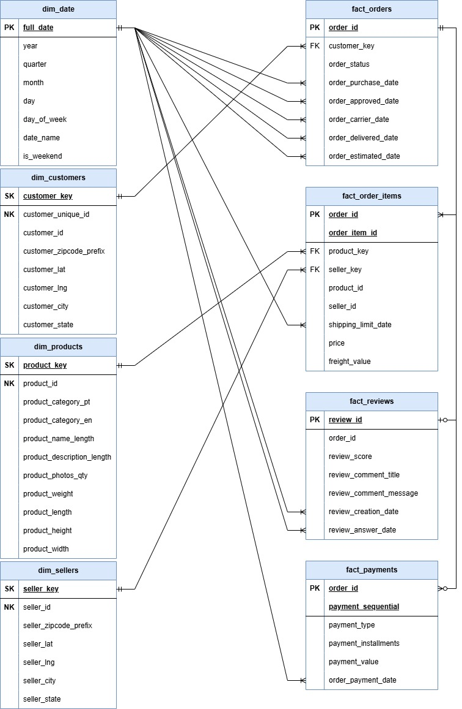
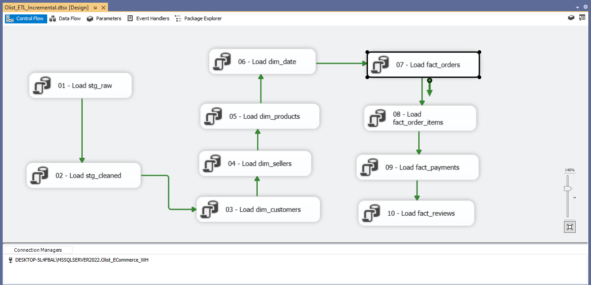
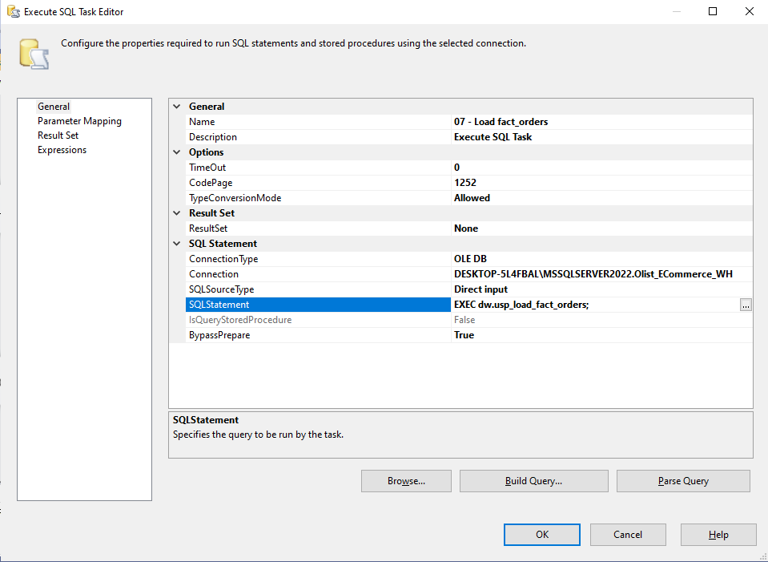
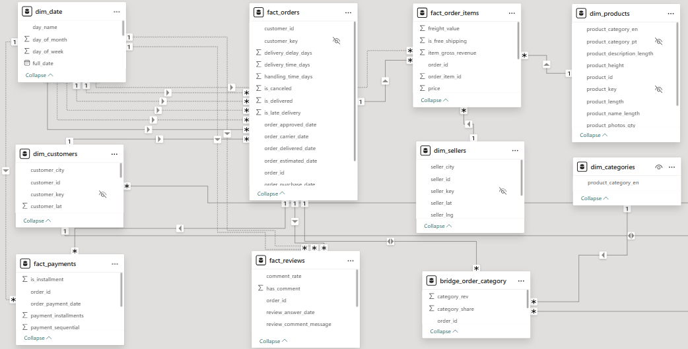
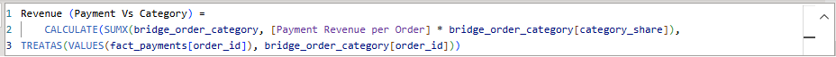

# Olist E-Commerce Analytics Platform

End-to-end analytics platform built on the Olist Brazilian E-Commerce dataset, designed with
production-style data warehousing, incremental ETL, and semantic BI modeling.

This project demonstrates how to move from raw data to business insights using SQL Server,
SSIS, and Power BI.

---

## 1. Business Context

Olist is a Brazilian e-commerce marketplace connecting small sellers to customers across Brazil.

This project aims to answer:
- How sales, revenue, and customer behavior evolve over time
- Which product categories and regions drive performance
- How customers differ between new, returning, and repeat buyers
- How payment methods impact category performance

---

## 2. Solution Architecture

The platform follows a layered data architecture designed for production-style
analytics with incremental ETL and clear separation of concerns.

Data flows from raw CSV sources through staging layers into a dimensional
data warehouse, which serves as the single source of truth for BI and analytics.

---

## 3. Data Model (DW Core)

The data warehouse is modeled using a dimensional (star-schema) approach with
clear separation of fact tables by grain.

### High-level dimensional model

### Full dimensional model (technical view)

---

## 4. ETL & Data Engineering (SSIS)

## 4. ETL & Data Engineering (SSIS)

The ETL layer is implemented using SQL Server Integration Services (SSIS) and
designed to support incremental, production-style data loading.

SSIS is responsible for orchestration, while business logic and incremental
load rules are encapsulated in SQL Server stored procedures.

### ETL Control Flow

### Incremental Load Implementation

---

## 5. Power BI Data Modeling

Power BI imports curated tables from the DW core (Import mode) and applies a star-schema semantic layer.
The model keeps facts at their natural grain (orders, items, payments, reviews) and uses a bridge table to
enable Payment × Category analysis without using bidirectional relationships.

### Semantic model (relationships)

### Payment × Category using bridge + TREATAS

---

## 6. Dashboards

- Overview
- Sales Performance
- Category Analysis
- Customer Behavior
- Drill-through Analysis

(Screenshots added below)

---

## 7. Key Business Insights

(To be added)

---

## 8. Reproducibility

Steps to reproduce:
1. Restore SQL Server database
2. Run SSIS packages
3. Open Power BI report

---

## 9. Repository Structure

01_Business_Context
02_Data_Source
03_Data_Architecture
04_ETL_SSIS
05_SQL_Data_Warehouse
06_Power_BI

---

## 10. Tech Stack

- SQL Server
- SSIS
- Power BI
- Git & GitHub

---

## 11. Future Improvements

- Incremental refresh in Power BI Service
- Automated data quality tests
- CI/CD for ETL deployment
