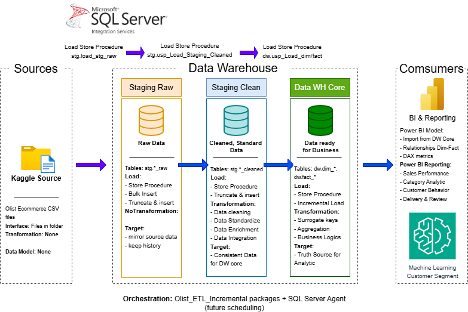
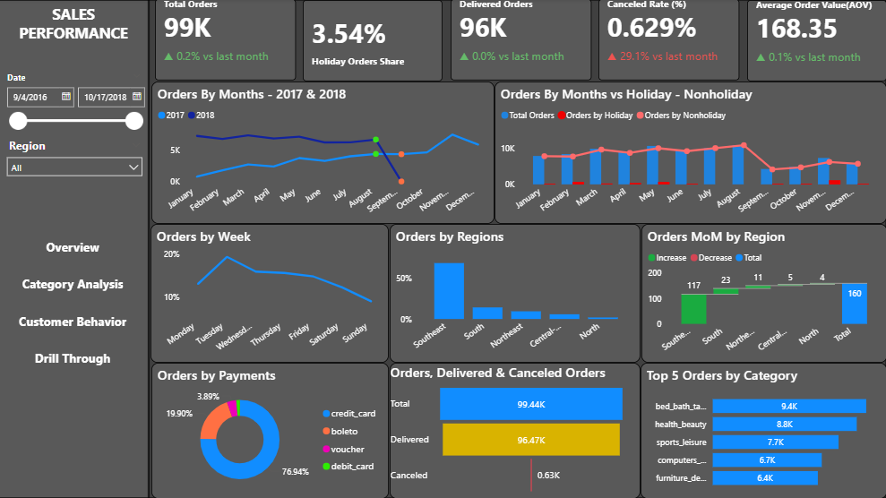
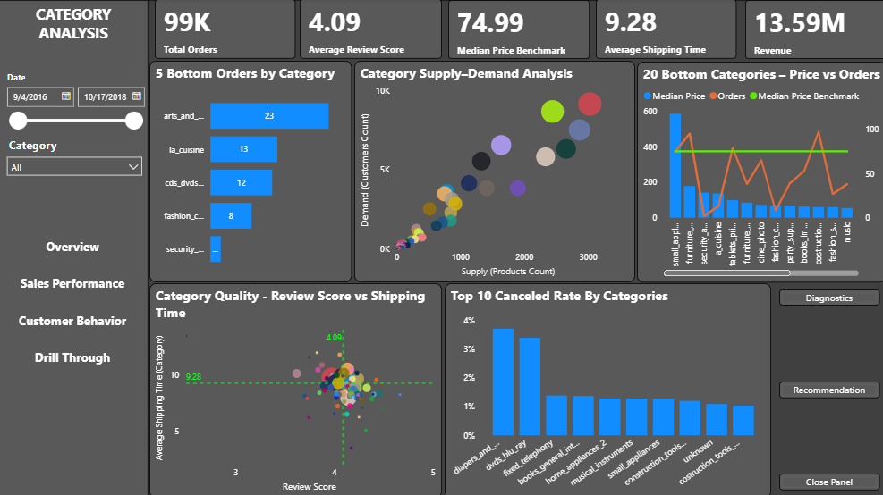
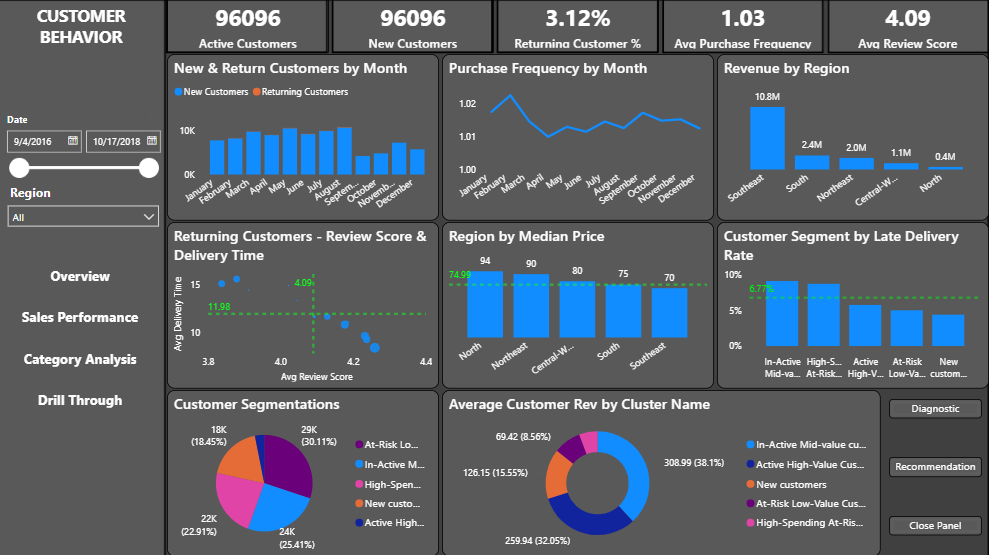
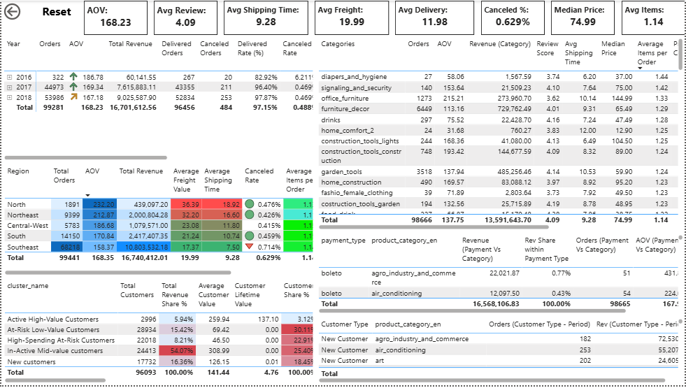
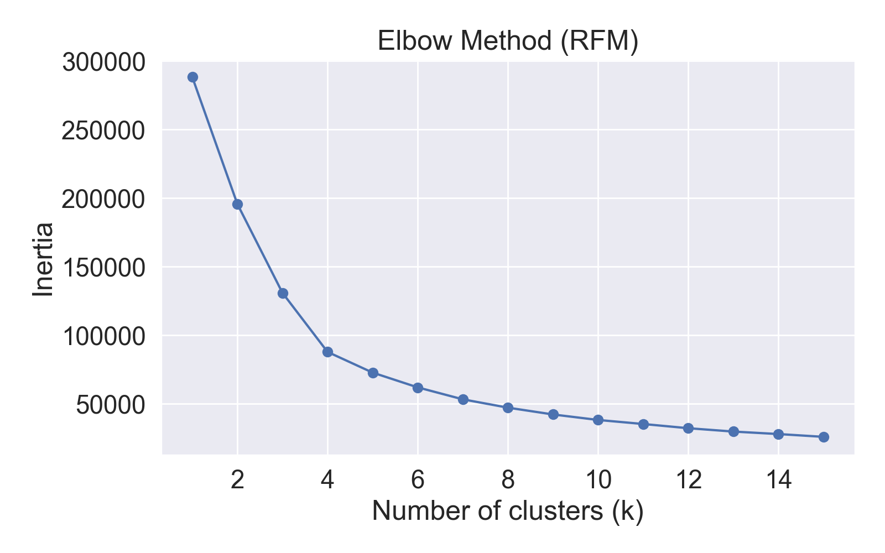
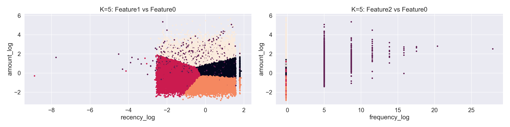

# Olist E-Commerce Analytics Platform

End-to-end analytics platform built on the Olist Brazilian E-Commerce dataset, designed with
production-style data warehousing, incremental ETL, and semantic BI modeling.

This project demonstrates how to move from raw data to business insights using SQL Server,
SSIS, and Power BI.

---

## 1. Business Context

Olist is a Brazilian e-commerce marketplace connecting small sellers to customers across Brazil.

This project aims to answer:
- How sales, revenue, and customer behavior evolve over time
- Which product categories and regions drive performance
- How customers differ between new, returning, and repeat buyers
- How payment methods impact category performance

---

## 2. Solution Architecture

The platform follows a layered data architecture designed for production-style
analytics with incremental ETL and clear separation of concerns.

Data flows from raw CSV sources through staging layers into a dimensional
data warehouse, which serves as the single source of truth for BI and analytics.

---

## 3. Data Model (DW Core)

The data warehouse is modeled using a dimensional (star-schema) approach with
clear separation of fact tables by grain.

### High-level dimensional model

### Full dimensional model (technical view)

---

## 4. ETL & Data Engineering (SSIS)

The ETL layer is implemented using SQL Server Integration Services (SSIS) and
designed to support incremental, production-style data loading.

SSIS is responsible for orchestration, while business logic and incremental
load rules are encapsulated in SQL Server stored procedures.

### ETL Control Flow

### Incremental Load Implementation

---

## 5. Power BI Semantic Model

Power BI imports curated tables from the DW core (Import mode) and applies a star-schema semantic layer.
The model keeps facts at their natural grain (orders, items, payments, reviews) and uses a bridge table to
enable Payment × Category analysis without using bidirectional relationships.

### Semantic model (relationships)

### Payment × Category using bridge + TREATAS

---

## 6. Dashboards

### 6.1 Overview Dashboard

Key KPIs:
- Total Orders
- Delivery & Cancellation Rates
- On-time Delivery
- Average Review Score

---

### 6.2 Sales Performance

Focus:
- Revenue & order trends
- Monthly growth
- Regional performance

---

### 6.3 Category Analysis

Focus:
- Top & bottom categories
- Revenue contribution
- Product mix

---

### 6.4 Customer Behavior

Focus:
- New vs Returning customers
- RFM segmentation
- Purchase frequency

---

### 6.5 Drill-through Analysis

Focus:
- Category → Order → Customer drill-through
- Payment & delivery impact analysis

---

## 7. Advanced Analytics – Customer Segmentation (RFM + KMeans)

In addition to descriptive analytics, this project applies **machine learning–based customer segmentation**
to better understand demonstrated customer value and churn risk.

### 7.1 RFM Feature Engineering
- **Recency**: Days since last purchase
- **Frequency**: Number of completed orders
- **Monetary**: Total payment amount

RFM metrics are computed from the data warehouse and exported for analytical modeling.

### 7.2 KMeans Clustering
- Log-scaled RFM features
- Elbow method used to evaluate optimal cluster count
- Final business-driven selection: **K = 5** (interpretable, actionable)

### 7.3 Cluster Visualization

### 7.4 Cluster Interpretation & Labeling

Clusters are mapped to business-friendly segments:

| Cluster Name | Description |
|-------------|------------|
| Active High-Value Customers | Frequent, recent, high spend |
| High-Spending At-Risk Customers | High spend but declining recency |
| In-Active Mid-Value Customers | Moderate spend, long inactivity |
| At-Risk Low-Value Customers | Low spend, long inactivity |
| New Customers | Recent, low frequency |

### 7.5 Persisting Results Back to the Warehouse
- Final cluster labels are written back to:
  `mart.customer_rfm_clusters`
- Enables direct use in Power BI without Python dependency

This creates a **closed analytics loop**:
DW → Python ML → DW → Power BI.

---

## 8. Key Business Insights

### 1. Delivery performance strongly impacts customer satisfaction
- Orders delivered on time have significantly higher review scores
- Late deliveries correlate with lower ratings and repeat purchase drop

**Action:**  
Improve seller handling SLA and prioritize high-delay regions.

---

### 2. A small number of categories drive most revenue
- Top 5 categories contribute the majority of total revenue
- Long-tail categories have low volume but high operational cost

**Action:**  
Focus marketing and inventory optimization on high-performing categories.

---

### 3. High churn after first purchase
- Majority of customers purchase only once
- Returning customers generate higher AOV and better reviews

**Action:**  
Introduce loyalty campaigns targeting first-time buyers.

---

### 4. Payment method influences order completion
- Installment-based payments show higher completion rates
- Certain payment types correlate with cancellations

**Action:**  
Promote preferred payment methods during checkout.

---

## 9. Reproducibility

Steps to reproduce the analytics environment:

1. Restore the SQL Server database from `05_SQL_Data_Warehouse`
2. Configure connection strings and run SSIS incremental packages
3. Open the Power BI report from `06_Power_BI` (Import mode)

---

## 10. Repository Structure

01_Business_Context/ # Business problem, KPIs, assumptions
02_Data_Source/ # Raw dataset description (Kaggle)
03_Data_Architecture/ # Architecture diagrams & ERDs
04_ETL_SSIS/ # SSIS packages & incremental logic
05_SQL_Data_Warehouse/ # DDL, stored procedures, fact/dim tables
06_Power_BI/ # Semantic model & dashboards

---

## 11. Tech Stack

- SQL Server (Data Warehouse)
- SSIS (Incremental ETL)
- Power BI (Semantic model & dashboards)
- Git & GitHub (Version control)

---

## 12. Future Improvements

- Incremental refresh in Power BI Service
- Automated data quality tests
- CI/CD for ETL deployment
